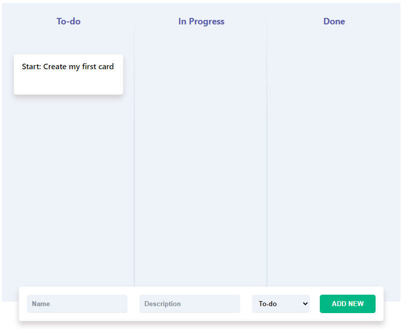

# KanbanDB App



This is my implementation of the KanbanDB App which was developed with React.

## Setup
Clone the repo to your local environment
```
git clone https://github.com/joe-orav/kanbandb-app-template.git
```
Navigate to the app directory
```
cd kanbandb-app-template
```
Run the React app
```
npm start
```